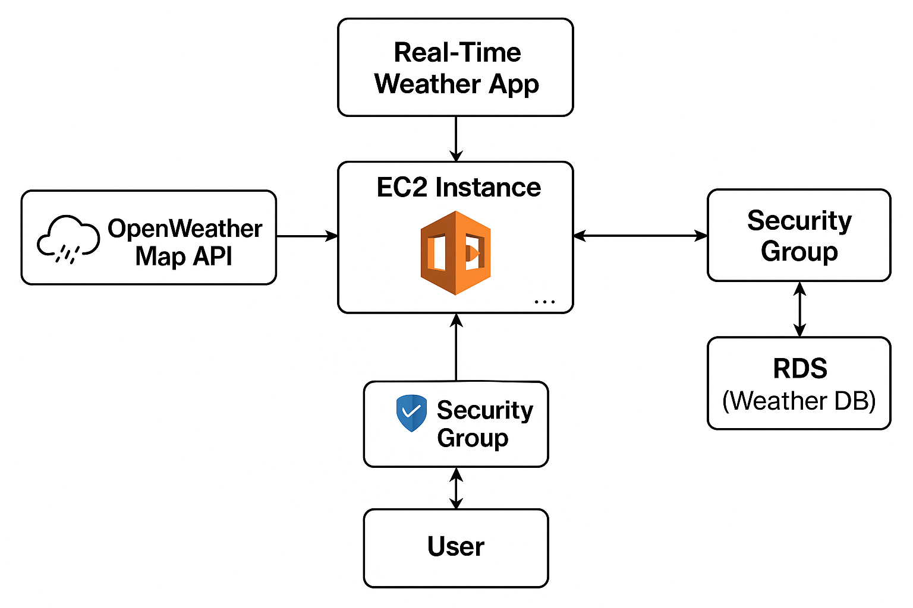

# 🌦️ Real-Time Weather App (Deployed on AWS)

A simple Flask web application that fetches real-time weather data using the OpenWeatherMap API, displays results in the browser, and stores search history in an AWS RDS PostgreSQL database. Hosted on an EC2 instance.

---

## 🚀 Purpose
To gain hands-on experience with deploying Python applications using AWS infrastructure (EC2 + RDS) and integrating external APIs.

---

## 🔧 Technologies Used
- Python (Flask)
- PostgreSQL (RDS)
- HTML/CSS + Bootstrap
- OpenWeatherMap API
- AWS EC2 (Ubuntu)
- AWS RDS (PostgreSQL)
- Git & GitHub

---

## 📦 AWS Setup Summary
- **EC2 Instance**: Hosts Flask backend
- **RDS Instance**: PostgreSQL DB to store weather search history
- **Security Groups**: Configured to allow HTTP (8080) + DB access
- **API**: OpenWeatherMap for weather data

---

## ⚙️ How It Works
1. User searches a city from a web form.
2. Flask calls the OpenWeatherMap API.
3. Result is shown on screen and saved in PostgreSQL.
4. Users can view last 10 search results via `/history`.

---

## 🖼️ Architecture Diagram

---
